<div align="center">



<br>

[](https://my.home-assistant.io/redirect/hacs_repository/?owner=jrx-code&repository=hassio-integration-inpost&category=integration)


**Track your InPost parcels natively in Home Assistant — ready-to-pickup, in-transit and archive, as first-class entities.**

</div>

---

## ✨ Features

- 📥 **Do odbioru** — how many parcels are ready to pick up, with sender, locker, pickup code, expiry and QR payload in attributes
- 🚚 **W drodze** — parcels on the way, with human-readable Polish statuses
- 🗄️ **Archiwum** — recently delivered / closed parcels (capped, configurable)
- 👥 **Multi-account** — add several InPost numbers, each as its own device
- 🤝 **App-to-app sharing** — hand a ready parcel to another configured account (a paired InPost "friend"), on a button press or automatically
- 🔑 **SMS login, no scraping** — official legacy mobile auth; the refresh token is stored encrypted by HA
- 🧩 **Almost dependency-free** — stdlib `urllib` client; the only requirement is `segno`, for rendering pickup QR codes
- 🎨 **Native branding** — proper InPost icon in the integrations list

## 📦 Entities (per account)

| Entity | State | Key attributes |
|---|---|---|
| `sensor` · **Do odbioru** | number ready to pick up | `do_odbioru_count`, `w_drodze_count`, `do_odbioru[]` (nadawca, kod odbioru, paczkomat, adres, termin, `qr`), `w_drodze[]` |
| `sensor` · **W drodze** | number in transit | — |
| `sensor` · **Archiwum** | number archived | `archiwum[]` (latest N) |

> The `qr` payload lets a Lovelace card render the compartment-opening QR client-side.
> Each `do_odbioru[]` row also reports its sharing state: `wlasciciel` (`OWN` /
> `FRIEND` / `OBSERVED`), `udostepniona_do` and `mozna_udostepnic`.

## 🤝 Sharing a parcel with another account

Configure two InPost accounts and each device gains one entity per *other*
account:

| Entity | What it does |
|---|---|
| `button` · **Udostępnij → \<alias\>** | shares every ready parcel not already shared with that account |
| `switch` · **Auto-udostępnianie → \<alias\>** | keeps doing it for each newly ready parcel, on every poll |

The recipient's account then lists those parcels normally — including pickup code
and QR — so their sensors, QR image entities and cards need no extra wiring.

Prerequisites and limits:

- The two InPost accounts must already be **paired in the InPost mobile app**
  (Settings → *Sparuj użytkownika*, invitation code). Pairing cannot be done over
  this API; until it is done, both entities stay *unavailable*.
- InPost decides per parcel whether sharing is allowed (`operations.canShareParcel`);
  parcels it refuses are skipped.
- **Sharing is not undone here.** Turning the switch off stops new shares; it does
  not withdraw parcels already shared. Withdrawing is an app-side action.
- Entities for a peer account are created when the entry is set up — after adding
  a *new* account, reload the other one so it picks up the new peer.

## 🚀 Installation

### HACS (recommended)

1. HACS → **⋮** → *Custom repositories* → add `https://github.com/jrx-code/hassio-integration-inpost` as **Integration** — or just click the **Open in HACS** badge above.
2. Install **InPost Paczkomaty**, then restart Home Assistant.

### Manual

Copy `custom_components/inpost/` into your Home Assistant `config/custom_components/` and restart.

## ⚙️ Configuration

**Settings → Devices & Services → Add Integration → InPost Paczkomaty**

```
1.  Alias        →  e.g. "Home"
2.  Prefix       →  dropdown, default +48
3.  Phone        →  9 digits
4.  SMS code     →  6 digits sent to that number
```

When the refresh token expires, Home Assistant starts a re-auth (a fresh SMS). Per-entry **options**: polling interval (default 15 min), archived-parcels cap, ready-to-pickup notification flag.

## 🔧 Under the hood

- **Legacy SMS auth** on the mobile API — no captcha, unlike the OAuth backend (Cloudflare Turnstile).
- **ETag pagination** on `/v4/parcels/tracked` — InPost (ab)uses `ETag`/`If-None-Match` as a page cursor; a naive single GET misses recent parcels.
- Blocking `urllib` client driven from Home Assistant's executor; `304` responses keep the last snapshot.

## ⚠️ Disclaimer

Unofficial integration, not affiliated with or endorsed by InPost. It talks to the InPost mobile API on your behalf using your own account; use it at your own discretion. InPost name and logo belong to their respective owner.

## 📄 License

[MIT](LICENSE) © JI ENGINEERING
